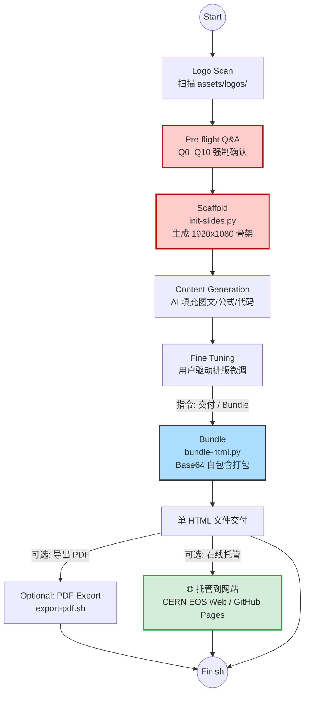
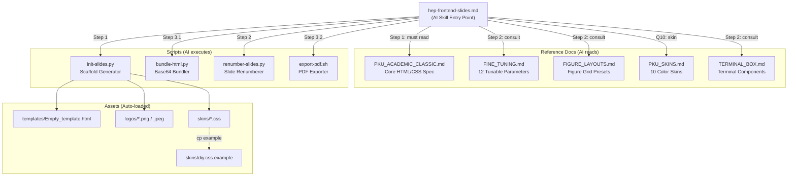

<h1 align="center" style="background: linear-gradient(90deg, #cc0000, #3b82f6, #8b5cf6); -webkit-background-clip: text; -webkit-text-fill-color: transparent; background-clip: text; font-family: 'PingFang SC', sans-serif; font-size: 3rem; font-weight: 600; margin-bottom: 0.5rem; letter-spacing: -1px;">
  ⚡️ Frontend Slides (PKU Edition) ⚡️
</h1>

<p align="center" style="color: #64748b; font-size: 0.95rem; font-family: sans-serif; font-weight: 400;">
  一个用 HTML 制作惊艳、富动画学术演示文稿的 AI 技能 — 动态多 Logo、10 款配色皮肤 + DIY 自定义。
</p>

<p align="center">
  <a href="README.md"></a>&nbsp;
  <a href="README_EN.md"></a>
</p>

<p align="center">
  
  
  
  
  
  <a href="https://github.com/zarazhangrui/frontend-slides/tree/main"></a>
  
</p>

---

> [!NOTE]
> **致谢** — 本项目分叉自 [@zarazhangrui/frontend-slides](https://github.com/zarazhangrui/frontend-slides/tree/main)。
> 
> **新增内容** — 引入 **PKU Academic Classic** 学术模板：动态多 Logo 注入、10 款配色皮肤 + DIY 自定义、严格排版约束与脚手架自动化。
> 
> 💡 **风格彩蛋：** 过渡页大标题使用了 `'Comic Sans MS'` —— 致敬 CERN CMS 早期报告中的极客反差美学。

---

## ⚡ 3 steps (Quick Start)

| Step | 操作 | 说明 |
|------|------|------|
| **1. Plan + Scaffold** | `python3 init-slides.py --title ... --out talk.html` | 回答 Q0–Q10 → 生成 1920×1080 含 Logo/Header/Footer 的骨架 |
| **2. Content + Fine-tune** | *(AI 填充 → 你预览 → 反复迭代)* | AI 注入图/表/公式，你用自然语言微调排版 |
| **3. Bundle + (PDF)** | `python3 bundle-html.py talk.html` | 所有图片内嵌为 Base64 → 单文件自包含 HTML |

> 💡 **可选：** `bash export-pdf.sh talk_bundle.html` 转为 PDF 用于邮件/打印（详见下方参数表）。

---

## 🚀 核心工作流



---

## 💡 使用方式

你**只需要用自然语言向 AI 描述需求**，它会在后台自动调配正确的脚本管线完成全部技术操作。

> [!TIP]
> 强烈建议在动工前让 Agent 进入 Plan 模式，尤其推荐辅助配合 [superpowers writing-plans](https://github.com/obra/superpowers/tree/main/skills/writing-plans) 技能。最好预先逐页规划好需求。

https://github.com/user-attachments/assets/7acc9292-5fa3-424e-9d57-2e364f658788

```text
/hep-frontend-slides

> "使用 PKU_CMS 经典版式帮我做一份下周 CMS 开组会的幻灯片：
> p1 主要讲 Motivation，需要罗列...
> p2 讲解 120 ADC cut 的影响，放一张 6 图对比网格...
> p3 总结结论，加一个高亮框..."
```

**Agent 会：**

1. 在生成任何 HTML 代码之前，**它必须强制弹窗向你确认**以下学术规范信息：

   | # | 问题 | 对应位置 | 默认值 |
   |---|------|---------|--------|
   | Q0 | 选择 Logo：自动扫描 `assets/logos/`，问你用哪些 | Logo 栏 | PKU + CMS |
   | Q1 | 报告主标题？哪些关键词 highlight？ | `<h1>` title-banner + footer-left | 无（必填） |
   | Q2 | 报告类型/会议名称？ | `<h2>` title-banner + footer-right | 无（必填） |
   | Q3 | 作者列表？ | author-info | 无（必填） |
   | Q4 | 演讲者是谁？（扉页加下划线、footer 居中） | author-info + footer-center | 无（必填） |
   | Q5 | 单位列表？ | author-info | 无（必填） |
   | Q6 | 报告日期？ | author-info | 当天日期 |
   | Q7 | Reference 引用？ | author-info | 可选 |
   | Q8 | Outline 列表？ | Outline + transition slides | 无（必填） |
   | Q9 | HTML 输出路径？ | `init-slides.py --out` | 无（必填） |
   | Q10 | 配色皮肤？ | `init-slides.py --skin` | classic |

2. 收集完毕后，触发 `init-slides.py`，瞬间铺设好 **1920×1080** 且包含物理机构多 Logo 的严格排版骨架。

3. 渲染完成后供你预览网页，**你可以使用 VSCode 插件 Live Server 在浏览器中实时查看效果**。

---

### 📦 Slide 内置元素一览

以下是 PKU Academic Classic 模板支持的全部内容元素：

| 元素 | 说明 | HTML 标记 |
|------|------|-----------|
| **Bullet List** | L1 红色圆点 + L2 红色破折号 | `<ul class="bullet-list">` |
| **Sub-bullet** | 缩进二级子弹点 | `<ul>` 嵌套在 `<li>` 内 |
| **Hyperlink** | 蓝色下划线链接（新标签页打开） | `<a href="..." target="_blank">` |
| **Highlight Accent** | 主题色高亮关键词 | `<span class="highlight-accent">` |
| **MathJax** | 行内 `$...$` / 独立 `$$...$$` 公式 | 自动渲染 |
| **Highlight Box** | 🔴 红色结论框 | `<div class="highlight-box">` |
| **Important Box** | 🔵 蓝色重要信息框 | `<div class="important-box">` |
| **Warning Box** | 🟠 橙色警告框 | `<div class="warning-box">` |
| **Tip Box** | 🟢 绿色提示框 | `<div class="tip-box">` |
| **Figure Grid** | 多图网格布局 (1×1 ~ 4×4) | `<div class="fig fig-2x4">` |
| **Table** | 学术数据表（含标题） | `<div class="tab">` |
| **Terminal (动态)** | 打字机动画 + 自动滚动 | `.mac-terminal` + `data-delay` |
| **Terminal (静态)** | 代码展示 + 行号 | `.mac-terminal-lined` |
| **多语言代码** | C++ / Python / JS / HTML / Rust | 不同 `--term-accent` 颜色 |

> 💡 所有元素的实际渲染效果可查看 [在线 Skin 预览](https://ky230.github.io/Html-slides-public/Hfrontend-slides-PKU-skin/classic/index.html)

---

### ⭐️ 核心增强：持续排版微调 (Fine-tuning)

不同于传统单次生成工具，你可以像指挥助手一样反复下达指令进行修改（例如：*"第三页字太大，帮我缩小并加个红色的 highlight-box"*）。

每个可调元素上方都有标准化注释块，标注了所有可调参数：

```html
<!-- FINE TUNING: 
     - bullet-list: adjust 'font-size' and 'margin-top'
     - boxes: adjust 'margin' and 'font-size'
-->

<!-- [BULLETS]: Main analysis | KNOBS: top(100px), left(0), width(48%), font-size(1.85em) -->
```

详细参数速查表见 `reference/FINE_TUNING.md`，涵盖 Bullet、Image、Table、Terminal 等 12 类元素的完整调参指南。

#### 🔧 手动微调入门 (HTML/CSS 速查)

如果你想直接编辑 HTML 而非通过 AI，以下是最常用的 CSS 属性：

| 属性 | 作用 | 单位 | 示例 |
|------|------|------|------|
| `margin-top` | 向下推移元素 | `px` 或 `%` | `margin-top: 20px` |
| `margin-left` | 向右推移（负值=向左） | `px` 或 `%` | `margin-left: -40px` |
| `font-size` | 文字大小 | `em` (相对) 或 `px` | `font-size: 1.6em` |
| `width` | 区域宽度 | `%` 或 `px` | `width: 55%` |
| `gap` | 网格/列间距 | `px` | `gap: 8px` |
| `top` / `left` / `right` | 绝对定位偏移 | `px` 或 `%` | `top: 100px` |

> 💡 **提示：** 目前的 Fine-Tuning 注释系统已十分完善，你完全可以直接用自然语言让 AI 修改。
> 例如：*"第 5 页的图向左移 20px，字缩小到 1.6em"*

---

4. **只有当排版完全符合你的要求后**，再向 AI 发出 **"bundle/交付"** 指令。它会将所有本地插图内嵌为 Base64，交付一份完全自包含的单文件 HTML。

5. 💡 **演示快捷键**：在生成的 HTML 中，按 **`F`** 可直接进入/退出浏览器全屏模式；按 **`G`** 会弹出跳转框，输入页码后回车即可快速跳转到对应 Slide。

---

### 📄 导出 PDF (可选)

```bash
bash scripts/export-pdf.sh <input.html> [output.pdf] [options]
```

| Flag | Default | Description |
|------|---------|-------------|
| *(位置参数 1)* | — | 输入 HTML 路径（必填） |
| `[output.pdf]` | `<input>_export.pdf` | 输出 PDF 路径 |
| `--dpr N` | `3` | Device Pixel Ratio — 控制截图分辨率 |
| `--compact` | off | 使用 1280×720 视口（文件缩小 50-70%） |

**分辨率 × 文件大小参考：**

| `--dpr` | 视口 | 18 页大小 | 用途 |
|---------|------|-----------|------|
| `1` | 1920×1080 | ~12MB | 日常分享 (Slack/邮件) |
| `2` | 3840×2160 | ~24MB | 高质量打印 |
| `3` *(默认)* | 5760×3240 | ~48MB | 存档 / 出版 |
| `1 --compact` | 1280×720 | ~6MB | 快速预览 |

> ⚠️ **前置依赖：** 需要 Node.js + npm（Playwright 首次运行时自动安装）。
> PDF 保留颜色/字体/排版，但**不保留动画**（静态截图导出）。

---

### 🗣️ 各阶段 Prompt 示例

**Stage 1 — 启动：**
```text
/hep-frontend-slides
使用 PKU+CMS logo 做一份 20 页的 pre-approval slides，标题是 "Search for BSM H→ττ"，
高亮 "BSM" 和 "H→ττ"，用 classic 配色。
```

**Stage 2 — Fine-tuning：**
```text
第 5 页的图太小了，放大到 width: 80%，margin-top 减少到 10px。
第 8 页加一个 warning-box，内容是 "Preliminary results only"。
```

**Stage 3 — 交付：**
```text
bundle
```

**Stage 3b — PDF 导出：**
```text
导出 PDF，用 --dpr 2 减小文件大小
```

---

## 🌐 极速分享 — HTML 托管方案

Bundle 后的 HTML **已内嵌全部图片**（Base64），无需额外上传附件。直接将单文件 HTML 放到任何静态托管服务上即可**秒渲染**——告别互相发送 `.pdf` / `.pptx`，随时修改、随时在线。

| 方案 | 地址格式 | 适用场景 |
|------|----------|----------|
| **CERN EOS Web** | `https://{your_cms_web}.web.cern.ch/` | CERN 内部分享 |
| **GitHub Pages** | `https://{username}.github.io/{repo}/` | 公开分享 |

> 💡 **参考示例：**
> - GitHub Pages: [ky230.github.io/Html-slides-public](https://ky230.github.io/Html-slides-public/)
> - CERN EOS Web: [hig-25006.web.cern.ch/HTML_SLIDES](https://hig-25006.web.cern.ch/HTML_SLIDES/)

**CERN EOS Web 部署：**
```bash
# 将 bundle HTML 复制到 EOS web 目录
cp talk_bundle.html /eos/user/{initial}/{username}/www/slides/
# 即可通过 https://{username}.web.cern.ch/slides/talk_bundle.html 访问
```

**GitHub Pages 部署：**
```bash
# 将 bundle HTML 推送到公开仓库
cp talk_bundle.html /path/to/your-pages-repo/
cd /path/to/your-pages-repo && git add . && git commit -m "add slides" && git push
# 即可通过 https://{username}.github.io/{repo}/talk_bundle.html 访问
```

> ⚠️ **注意：** Bundle HTML 文件通常较大（10-50MB），GitHub 单文件限制 100MB。超大文件建议使用 CERN EOS Web。

---

## 🤖 自动接入各类 AI

告别手动搬运文件。`hep-frontend-slides.md` 包含全套系统设定约束（涵盖 Token 控制、画板比例、防破坏流控）。
**请按照以下步骤让你的 AI Agent 自己完成下载与装配绑定：**

### 1️⃣ 克隆仓库
在你的电脑或服务器上将本仓库 Clone 下来：
```bash
git clone https://github.com/ky230/frontend-slides-PKU.git
```
*(操作完后，复制记录该文件夹的绝对路径，例如 `/Users/name/frontend-slides-PKU`)*

### 2️⃣ 复制安装提示词
复制以下对应你所使用的 AI 的系统 Prompt 并直接甩给它（AI 会自动将 `{{FRONTEND_SLIDES_REPO_PATH}}` 替换为你告诉它的本地绝对路径）：

<details open>
<summary><b>Gemini / Antigravity / Cursor / Cline（IDE 类 Agent）</b></summary>

```text
⚠️ SYSTEM INSTRUCTION: 
I have cloned the "frontend-slides-PKU" repository to my local machine. 
1. Locate the absolute path of the directory, or ask me for it.
2. Read the `hep-frontend-slides.md` file located inside it.
3. Install the rules into your global workflows/skills directory (or .cursorrules if applicable). 
4. IMPORTANT: During installation, replace ALL occurrences of `{{FRONTEND_SLIDES_REPO_PATH}}` in the markdown with the EXACT absolute directory path where this repository is located.
```
</details>

<details open>
<summary><b>GitHub Copilot Chat（VSCode）</b></summary>

```text
@workspace I want to use a new workflow. Please read the `hep-frontend-slides.md` file from the cloned frontend-slides-PKU repository. Then, create a new file named `hep-frontend-slides.md` in my `.github/copilot-instructions/` directory (create the directory if it doesn't exist). Before writing, replace all `{{FRONTEND_SLIDES_REPO_PATH}}` placeholders with the absolute path of the directory you just read from.
```
</details>

<details open>
<summary><b>Claude Code（CLI 命令行）</b></summary>

```bash
claude "Read the hep-frontend-slides.md file from the frontend-slides-PKU directory. Copy its contents, replace all {{FRONTEND_SLIDES_REPO_PATH}} placeholders with its absolute path, and save it as .claude.md in my current working directory so these rules are automatically loaded."
```
</details>

> [!NOTE]
> **Clone 后需要手动改源码吗？** 不需要。代码库本身零硬编码路径。唯一要做的就是按上面的步骤把安装 Prompt 贴给 AI，它会自动完成绑定。

---

## 📐 架构 — 文件依赖关系图



---

## 🎨 支持多种 Slides 风格

通过 `--skin` 参数选择配色皮肤。所有皮肤共享相同的 HTML 结构和 JS 逻辑，仅通过 CSS 变量覆盖实现换色。皮肤文件位于 `assets/skins/*.css`。

> 🖥️ **[在线预览所有皮肤 →](https://ky230.github.io/Html-slides-public/Hfrontend-slides-PKU-skin/classic/index.html)**

| # | | Skin | `--theme-primary` | `--theme-accent` | 风格 | 预览 |
|---|---|------|-------------------|-----------------|------|------|
| 1 | 🏛️ | `classic` | `#cc0000` | `#ffff00` | 北大红黄白（默认） | [Preview](https://ky230.github.io/Html-slides-public/Hfrontend-slides-PKU-skin/classic/index.html) |
| 2 | 🔥 | `bold` | `#ec5f18` | `#f3ecdb` | 橙色卡片 + 深色渐变 | [Preview](https://ky230.github.io/Html-slides-public/Hfrontend-slides-PKU-skin/bold/index.html) |
| 3 | 💎 | `cobalt` | `#4361ee` | `#f6f606` | 钴蓝 + 明黄 | [Preview](https://ky230.github.io/Html-slides-public/Hfrontend-slides-PKU-skin/cobalt/index.html) |
| 4 | ⚡ | `voltage` | `#0066ff` | `#d0f804` | 电离蓝 + 荧光黄 | [Preview](https://ky230.github.io/Html-slides-public/Hfrontend-slides-PKU-skin/voltage/index.html) |
| 5 | 🌿 | `botanical` | `#d4a574` | `#cb2c64` | 暖棕 + 品红 | [Preview](https://ky230.github.io/Html-slides-public/Hfrontend-slides-PKU-skin/botanical/index.html) |
| 6 | 🍀 | `jade` | `#2ca657` | `#f6f606` | 翡翠绿 + 明黄 | [Preview](https://ky230.github.io/Html-slides-public/Hfrontend-slides-PKU-skin/jade/index.html) |
| 7 | 💜 | `lavender` | `#9171a6` | `#f7f706` | 薰衣草紫 + 柠檬黄 | [Preview](https://ky230.github.io/Html-slides-public/Hfrontend-slides-PKU-skin/lavender/index.html) |
| 8 | 🌐 | `cyber` | `#2dd4bf` | `#f4f81d` | 赛博青 + 霓虹黄 | [Preview](https://ky230.github.io/Html-slides-public/Hfrontend-slides-PKU-skin/cyber/index.html) |
| 9 | 💻 | `terminal` | `#39d353` | `#39d353` | 黑客终端绿 | [Preview](https://ky230.github.io/Html-slides-public/Hfrontend-slides-PKU-skin/terminal/index.html) |

---

## 🔨 DIY — 自定义你的配色

### 1. 放入你的 Logo

将 Logo 图片放入 `assets/logos/` 目录：

```
assets/logos/
├── PKU_logo.jpeg          # 内置（git 跟踪）
├── CMS_logo.png           # 内置（git 跟踪）
├── CEPC_logo.png          # 内置（git 跟踪）
├── CERN_logo.png          # 内置（git 跟踪）
├── YOUR_Lab_logo.png      # ← 放入你自己的（自动 gitignore）
```

> **命名规范：** `{Name}_logo.{ext}`，支持 `.jpg` `.png` `.svg`，推荐高分辨率透明背景。
> Runtime JS 自动根据宽高比设置圆角（正方形→圆形，非正方形→圆角矩形）。

### 2. 自定义配色 (diy.css)

```bash
cd assets/skins
cp diy.css.example diy.css    # ← diy.css 不入库，随心改
```

编辑 `diy.css` 中的颜色变量，然后使用：

```bash
python3 scripts/init-slides.py --skin diy --logos YOUR_Lab_logo.png PKU_logo.jpeg ...
```

> 💡 `diy.css.example` 已包含所有可调参数的详细注释，每一行都标注了对应 slide 中的哪个元素。无需查阅文档即可上手。

---

*Created by [@zarazhangrui](https://github.com/zarazhangrui). Extended by Leyan Li with Academic Rigor.*  
*Inspired by the "Vibe Coding" philosophy — building beautiful things without being a traditional software engineer.*
