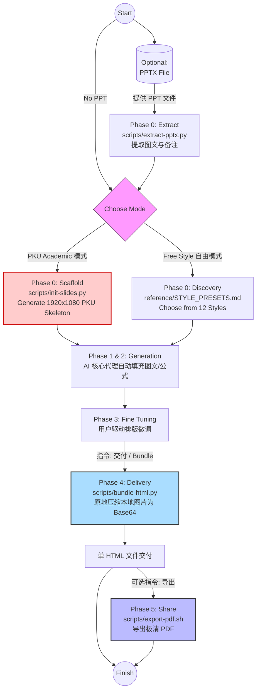

<h1 align="center" style="background: linear-gradient(90deg, #cc0000, #3b82f6, #8b5cf6); -webkit-background-clip: text; -webkit-text-fill-color: transparent; background-clip: text; font-family: 'PingFang SC', sans-serif; font-size: 3rem; font-weight: 600; margin-bottom: 0.5rem; letter-spacing: -1px;">
  ⚡️ Frontend Slides (PKU Edition) ⚡️
</h1>

<p align="center" style="color: #64748b; font-size: 0.95rem; font-family: sans-serif; font-weight: 400;">
  A Claude Code / Gemini skill for creating stunning, animation-rich HTML presentations — from scratch or by converting PowerPoint files.
</p>
<p align="center" style="color: #94a3b8; font-size: 0.8rem;">
  一个用 HTML 制作惊艳、富动画演示文稿的 AI 技能——支持单文件极致便携，或由 PPT 一键转换。
</p>

<p align="center">
  <a href="README.md"></a>&nbsp;
  <a href="README_EN.md"></a>
</p>

<p align="center">
  
  
  
  
  
  <a href="https://github.com/zarazhangrui/frontend-slides/tree/main"></a>
  
</p>

---

> [!NOTE]
> **致谢** — 本项目分叉自 [@zarazhangrui/frontend-slides](https://github.com/zarazhangrui/frontend-slides/tree/main)，保留了全部原始功能（PPT 提取、响应式视口、12 款视觉预设）。
> 
> **新增内容** — 引入 **PKU Academic Classic** 学术模板，为 CMS/CEPC 等正式组会汇报提供严格的排版约束与脚手架自动化。
> 
> 💡 **风格彩蛋：** 过渡页大标题使用了 `'Comic Sans MS'` —— 致敬 CERN CMS 早期报告中的极客反差美学。无此字体时自动回退 `cursive`。

---

## 🚀 核心工作流



---

## 💡 三种使用场景

你**只需要用自然语言向 AI 描述需求**，它会在后台自动调配正确的脚本管线完成全部技术操作。

> [!TIP]
> 强烈建议在动工前让 Agent 进入 Plan 模式，尤其推荐辅助配合 [superpowers writing-plans](https://github.com/obra/superpowers/tree/main/skills/writing-plans) 技能。最好预先逐页规划好需求：例如 p1 需要哪些图，p2 需要写定哪些 bullet。

**(1) PKU 学术模式**

https://github.com/user-attachments/assets/7acc9292-5fa3-424e-9d57-2e364f658788


```text
/hep-frontend-slides

> "使用 PKU_CMS 经典版式帮我做一份下周 CMS 开组会的幻灯片：
> p1 主要讲 Motivation，需要罗列...
> p2 讲解 120 ADC cut 的影响，放一张 6 图对比网格...
> p3 总结结论，加一个高亮框..."
```
**Agent 会：**
1. 在生成任何 HTML 代码之前，**它必须强制弹窗向你确认**以下学术规范信息：
   | # | 问题 | 对应位置 | 默认值 |
   |---|------|---------|--------|
   | Q0 | 选择品牌：CMS 还是 CEPC？ | Logo + footer | 无（必选） |
   | Q1 | 报告主标题？哪些关键词标黄？ | `<h1>` title-banner + footer-left | 无（必填） |
   | Q2 | 报告类型/会议名称？ | `<h2>` title-banner + footer-right | 无（必填） |
   | Q3 | 作者列表？ | author-info | 无（必填） |
   | Q4 | 演讲者是谁？（扉页加下划线、footer 居中） | author-info + footer-center | 无（必填） |
   | Q5 | 单位列表？ | author-info | 无（必填） |
   | Q6 | 报告日期？ | author-info | 当天日期 |
   | Q7 | Reference 引用？ | author-info | 可选 |
   | Q8 | Outline 列表？ | Outline + transition slides | 无（必填） |
   | Q9 | HTML 输出路径？ | `init-slides.py --out` | 无（必填，用户指定） |
2. 收集完毕后，触发 `init-slides.py`，瞬间铺设好 1920x1080 且包含物理机构双 Logo 的严格排版骨架。
3. 渲染完成后供你预览网页，**你可以使用 VSCode 插件 Live Server 在浏览器中实时查看效果**。
4. ⭐️ **核心增强：持续排版微调 (Fine-tuning)**。不同于传统单次生成工具，你可以像指挥助手一样反复下达指令进行修改（例如："第三页字太大，帮我缩小并加个红色的 highlight-box"）。
5. **只有当排版完全符合你的要求后**，再向 AI 发出 **"bundle/交付"** 指令。它会将所有本地插图内嵌为 Base64，交付一份完全自包含的单文件 HTML。
6. 💡 **演示快捷键**：在 PKU mode 生成的 HTML 中，按 **`F`** 可直接进入/退出浏览器全屏模式；按 **`G`** 会弹出跳转框，输入页码后回车即可快速跳转到对应 Slide。

**(2) Free 自由模式**

https://github.com/user-attachments/assets/dad50c60-f357-40e7-a72e-f055ea604550


```text
/hep-frontend-slides

> "按照 Free 模式，给我做一份关于最新 LLM 发展情况的 slides，10~15 页"
```
**Agent 会：**
1. 询问你的具体内容需求（幻灯片内容、文案、配图）。
2. 询问你想要的总体感受与基调（震撼？兴奋？沉稳？）。
3. 生成 3 种视觉风格的截屏预览供你比较并挑选。
4. 在你选定的风格下生成完整的演示文稿，并在浏览器或 Live Server 中供你直观预览。
5. ⭐️ **持续排版微调 (Fine-tuning)**：不断让 Agent 修改细节瑕疵直到完美。
6. 完全满意后，再下达 **"bundle/交付"** 指令执行最终的封口打包。

**(3) .pptx 转换为 Web 幻灯片**
```text
/hep-frontend-slides

> "把 `TB_Meeting.pptx` 转换成 Web 幻灯片 / Convert my presentation.pptx to a web slideshow"
```
**Agent 会：**
1. 自动提取原 PPT 中的所有文案内容、注脚备注，并无损提炼全部图像资产。
2. 向你展示提取出的内容大纲以供确认。
3. 让你自由挑选你最喜欢的新视觉风格。
4. 一键生成带图带字的完整 HTML 演示文稿（包含你的所有原始资产）。
5. ⭐️ **持续排版微调 (Fine-tuning)**：针对机器死板转换的地方进行灵活重新排版。
6. 最后当你认为一字不差时，向它下达 **"bundle/交付"** 指令打包封存。

---

## 🤖 自动接入各类 AI

告别手动搬运文件。`hep-frontend-slides.md` 包含全套系统设定约束（涵盖 Token 控制、画板比例、防破坏流控）。
**请按照以下步骤让你的 AI Agent 自己完成下载与装配绑定：**

### 1️⃣ 克隆仓库
在你的电脑或服务器上将本仓库 Clone 下来：
```bash
git clone https://github.com/ky230/frontend-slides-PKU.git
```
*(操作完后，复制记录该文件夹的绝对路径，例如 `/Users/name/frontend-slides-PKU`)*

### 2️⃣ 复制安装提示词
复制以下对应你所使用的 AI 的系统 Prompt 并直接甩给它（AI 会极其聪明地自动将 `{{FRONTEND_SLIDES_REPO_PATH}}` 替换为你告诉它的本地绝对路径，一键绑定系统）：

<details open>
<summary><b>Gemini / Antigravity / Cursor / Cline（IDE 类 Agent）</b></summary>

```text
⚠️ SYSTEM INSTRUCTION: 
I have cloned the "frontend-slides-PKU" repository to my local machine. 
1. Locate the absolute path of the directory, or ask me for it.
2. Read the `hep-frontend-slides.md` file located inside it.
3. Install the rules into your global workflows/skills directory (or .cursorrules if applicable). 
4. IMPORTANT: During installation, replace ALL occurrences of `{{FRONTEND_SLIDES_REPO_PATH}}` in the markdown with the EXACT absolute directory path where this repository is located.
```
</details>

<details open>
<summary><b>GitHub Copilot Chat（VSCode）</b></summary>

```text
@workspace I want to use a new workflow. Please read the `hep-frontend-slides.md` file from the cloned frontend-slides-PKU repository. Then, create a new file named `hep-frontend-slides.md` in my `.github/copilot-instructions/` directory (create the directory if it doesn't exist). Before writing, replace all `{{FRONTEND_SLIDES_REPO_PATH}}` placeholders with the absolute path of the directory you just read from.
```
</details>

<details open>
<summary><b>Claude Code（CLI 命令行）</b></summary>

```bash
claude "Read the hep-frontend-slides.md file from the frontend-slides-PKU directory. Copy its contents, replace all {{FRONTEND_SLIDES_REPO_PATH}} placeholders with its absolute path, and save it as .claude.md in my current working directory so these rules are automatically loaded."
```
</details>

> [!NOTE]
> **Clone 后需要手动改源码吗？** 不需要。代码库本身零硬编码路径。唯一要做的就是按上面的步骤把安装 Prompt 贴给 AI，它会自动完成 `{{FRONTEND_SLIDES_REPO_PATH}}` → 你本地绝对路径的绑定。


---

## 🎨 原版视觉预设

*如果你在选择模式时偏好 "Free Style" 自由模式而非 PKU 学术模式，你将解锁原作者精心设计调配的 12 款惊艳 Web 美学预设：*

| # | 文件 | 风格 | 类别 |
|---|---|---|---|
| 01 | `style_01_bold_signal.html` | **Bold Signal** — 橙色卡片 + 深色渐变 | 🌑 深色 |
| 02 | `style_02_electric_studio.html` | **Electric Studio** — 白蓝上下分割面板 | 🌑 深色 |
| 03 | `style_03_creative_voltage.html` | **Creative Voltage** — 电离蓝 + 霓虹黄左右分割 | 🌑 深色 |
| 04 | `style_04_dark_botanical.html` | **Dark Botanical** — 暗夜 + 暖色渐变光球 | 🌑 深色 |
| 05 | `style_05_notebook_tabs.html` | **Notebook Tabs** — 纸张卡片 + 彩色标签页 | ☀️ 亮色 |
| 06 | `style_06_pastel_geometry.html` | **Pastel Geometry** — 柔和蓝底 + 药丸几何 | ☀️ 亮色 |
| 07 | `style_07_split_pastel.html` | **Split Pastel** — 桃色/薰衣草双色对分 | ☀️ 亮色 |
| 08 | `style_08_vintage_editorial.html` | **Vintage Editorial** — 奶油底 + 大字报几何 | ☀️ 亮色 |
| 09 | `style_09_neon_cyber.html` | **Neon Cyber** — 赛博霓虹 + 粒子背景 | ✨ 个性 |
| 10 | `style_10_terminal_green.html` | **Terminal Green** — 黑客终端 + 扫描线 | ✨ 个性 |
| 11 | `style_11_swiss_modern.html` | **Swiss Modern** — 包豪斯网格 + 红色几何 | ✨ 个性 |
| 12 | `style_12_paper_ink.html` | **Paper & Ink** — 书卷气 + 首字下沉 + 引言特效 | ✨ 个性 |
---

## 🔨 DIY — 制作你的专属模板

你不必一直使用 PKU 或 Free 模式——你可以制作完全属于你自己组织的**第三种模式**。

<details>
<summary><b>▸ 展开完整 DIY 教程（5 步流程）</b></summary>

以下是我们在实战中验证过的完整流程，按照**从直觉到严谨**的顺序组织：

> [!IMPORTANT]
> **路径约定：** 本仓库严格遵循两层路径分离原则——
> 1. **环境注入层**（给 AI 看的 `.md` 规范/工作流）：统一使用 `{{FRONTEND_SLIDES_REPO_PATH}}/...`，由安装 Prompt 自动替换。
> 2. **产物生成层**（HTML 模板与脚本）：统一使用相对路径 `assets/xxx.png`。**禁止在 HTML 的 `` 中写绝对路径**，否则其他人 Clone 后会全部断裂。
> 
> Logo 放入 `assets/` 目录，文件名避免空格。`bundle-html.py` 会在交付时将它们全部转为 Base64，无需担心分发问题。

---

### Step 1: 准备你的 Logo 素材

将你机构的 Logo 图片（`.png` / `.jpeg`，推荐透明底）放入仓库的 `assets/` 目录：

```
assets/
├── PKU_logo.jpeg          # 已有
├── CMS_logo.png           # 已有
├── CEPC_logo.png          # 已有
├── YOUR_University.png    # ← 新增你自己的 Logo
└── YOUR_Lab_logo.png      # ← 新增你的实验室/合作组 Logo
```

> [!TIP]
> Logo 尺寸建议 **200×200px** 以上，背景透明 PNG 最佳。bundle-html.py 最终会把它们全部压制成 Base64，所以不用担心文件分发问题。

---

### Step 2: 用 AI 搭建你的空模板

这一步是最有趣的部分。你**不需要自己写 HTML/CSS**——直接把你常用的幻灯片截图扔给 AI，让它仿造：

```text
/hep-frontend-slides

> "我想创建一个全新的学术模板。请参考 assets/PKU_CMS_Classic_Empty.html 的完整结构和 JS 逻辑。
> 我的设计需求是：
> - 主色调换成 [你的颜色，如: 深蓝 #003366]
> - 顶部/底部栏换成 [你的机构名称]
> - Logo 使用 assets/YOUR_University.png 和 assets/YOUR_Lab_logo.png
> - 保留 1920x1080 固定画板、MathJax 支持、滚动吸附导航 等我喜欢的特性
>
> 这是我常用的几页 slides 截图，帮我匹配类似的视觉风格。"
```

**附上截图**（你平时用 PowerPoint/Keynote 做的那几页最满意的设计），AI 会基于 PKU 空模板的完整架构，帮你替换配色、Logo、字体，生成一份全新的：

```
assets/YOUR_LAB_Classic_Empty.html    ← AI 生成的空模板
```

> [!IMPORTANT]
> 空模板里只有框架代码（Logo、Header、Footer、进度条、一个占位 `<!-- END slides-scroller -->`），**没有实际内容页**。内容会在以后由 `init-slides.py` 动态注入。

---

### Step 3: 改造脚手架脚本 (init-slides.py)

现有的 `scripts/init-slides.py` 通过 `--template CMS` 或 `--template CEPC` 来选择空模板。你需要让它支持你的新模板：

```text
> "请修改 scripts/init-slides.py，新增 --template YOUR_LAB 选项。
> 当用户传入 --template YOUR_LAB 时，读取 assets/YOUR_LAB_Classic_Empty.html 作为骨架。
> 同时把 --speaker 的默认值改成你自己的名字，--affiliations 默认改成你的单位。"
```

修改后效果：
```bash
python3 scripts/init-slides.py \
  --template YOUR_LAB \
  --title "My Research Talk" \
  --author "Your Name:1" \
  --event "Lab Meeting" \
  --outline "Introduction:2" "Methods:3" "Results:2" "Back Up:1" \
  --out ./my_talk.html
```

> [!NOTE]
> `init-slides.py` 存在的意义是**硬性约束 AI 不得随机生成 HTML 骨架**。学术场景中，哪怕 Agent 的艺术细胞再好，也总会在「Header 高度、Logo 位置、进度条颜色」上犯微小但不可接受的错误。这个脚本让骨架 100% 来自你经过审查的空模板，杜绝了一切排版意外。

---

### Step 4: 编写你的样式规范文件

仿照 `reference/PKU_ACADEMIC_CLASSIC.md`，创建：
```
YOUR_LAB_CLASSIC.md
```

此文件是 AI 在填充内容时的**唯一法律**。它需要包含以下核心章节：

| 章节 | 用途 | 内容示例 |
|------|------|---------|
| **§0 Pre-flight 问答** | 强制 AI 在动笔前向用户确认的问题清单 | 品牌选择、主标题、作者、日期、Outline 列表 |
| **§1 Logo 资产** | 哪些图片文件、放在哪、HTML 中如何引用 | `` |
| **§2 品牌差异表** | 如果你有多个变体（如实验室 A vs B），列出差异 | Logo 不同、配色微调等 |
| **§3 完整 CSS** | 从你的 Empty.html 中原样提取，此处作为 AI 的参考副本 | `:root { --primary: #003366; ... }` |
| **§4 MathJax 配置** | 公式渲染引擎设定 | 通常可直接复制 PKU 的，无需修改 |
| **§5 HTML 结构模板** | Title/Outline/Transition/Content 各类页面的 HTML 骨架 | AI 填充时严格遵守这些 Tag 结构 |
| **§6 完整 JavaScript** | 从 Empty.html 提取的交互 JS（缩放、导航、进度条） | 通常可直接复制 PKU 版本 |
| **§7 生成规范总结** | 一张表总结所有硬性约束（字号、字体、颜色、间距） | 类似 PKU 的 27 条规范表 |

> [!TIP]
> 你不需要手写这 800+ 行。直接告诉 AI：
> ```text
> > "参考 reference/PKU_ACADEMIC_CLASSIC.md 的完整结构，为我的 YOUR_LAB_Classic_Empty.html 生成对应的样式规范文件。
> > 提取其中的 CSS、JS、HTML 结构，替换配色和 Logo 路径，保留其他所有约束。"
> ```

---

### Step 5: 注册到主 Skill 文件

最后一步，让 Agent 在启动幻灯片流程时能**看见并选择你的新模板**。

打开 `hep-frontend-slides.md`，找到模式选择的部分：
```markdown
> 请选择模板模式：
> 1. 🏛️ **PKU Academic Classic** — 组会/学术报告（红黄经典、双 Logo、固定版式）
> 2. ⚡️ **Free** — 自由风格（12 种预设、响应式、适合 pitch/tech talk/创意演示）
```

添加你的新选项：
```markdown
> 3. 🔬 **YOUR_LAB Classic** — 你的实验室专属模板（深蓝主题、双 Logo、固定版式）
```

然后在文件中仿照 PKU Academic 的规则段落，新增一块指向你的 `YOUR_LAB_CLASSIC.md` 的读取指令：
```markdown
### 如果选择 YOUR_LAB Classic
**必须先读取样式规范文件：**
```
{{FRONTEND_SLIDES_REPO_PATH}}/YOUR_LAB_CLASSIC.md
```
```

至此，你拥有了一套**完全由你的审美和学术需求定义的、不会被 AI 随手破坏的**专属演示文稿系统。

---

### 📝 完整 DIY Checklist

```
1. [ ] assets/ 目录放入你的 Logo 图片
2. [ ] 让 AI 仿照 PKU_CMS_Classic_Empty.html 生成你的空模板
3. [ ] 修改 init-slides.py 支持新的 --template 选项
4. [ ] 让 AI 仿照 reference/PKU_ACADEMIC_CLASSIC.md 生成你的样式规范
5. [ ] 在 hep-frontend-slides.md 中注册你的新模式
6. [ ] 用一场真实的组会汇报来实战验证！
```

---

</details>

---
*Created by [@zarazhangrui](https://github.com/zarazhangrui). Extended by Leyan Li with Academic Rigor.*  
*Inspired by the "Vibe Coding" philosophy — building beautiful things without being a traditional software engineer.*
