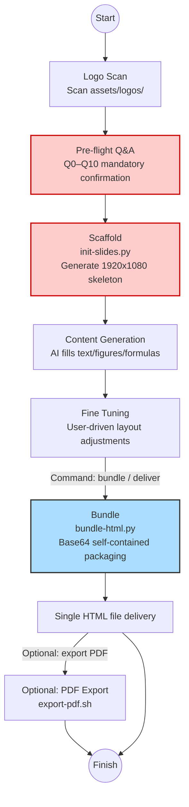
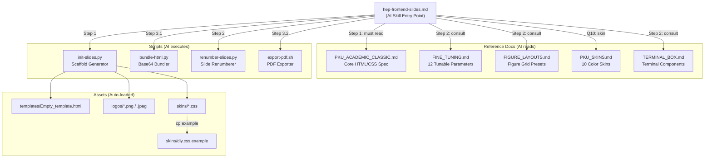

<h1 align="center" style="background: linear-gradient(90deg, #cc0000, #3b82f6, #8b5cf6); -webkit-background-clip: text; -webkit-text-fill-color: transparent; background-clip: text; font-family: 'PingFang SC', sans-serif; font-size: 3rem; font-weight: 600; margin-bottom: 0.5rem; letter-spacing: -1px;">
  ⚡️ Frontend Slides (PKU Edition) ⚡️
</h1>

<p align="center" style="color: #64748b; font-size: 0.95rem; font-family: sans-serif; font-weight: 400;">
  An AI skill for creating stunning, animation-rich academic HTML presentations — dynamic multi-logo, 10 color skins + DIY customization.
</p>

<p align="center">
  <a href="README.md"></a>&nbsp;
  <a href="README_EN.md"></a>
</p>

<p align="center">
  
  
  
  
  
  <a href="https://github.com/zarazhangrui/frontend-slides/tree/main"></a>
  
</p>

---

> [!NOTE]
> **Credits** — This project is forked from [@zarazhangrui/frontend-slides](https://github.com/zarazhangrui/frontend-slides/tree/main).
> 
> **Additions** — Introduces **PKU Academic Classic** academic template: dynamic multi-logo injection, 10 color skins + DIY customization, strict typographic constraints and scaffold automation.
> 
> 💡 **Style Easter Egg:** Transition slide titles use `'Comic Sans MS'` — a tribute to the geeky contrast aesthetic from early CERN CMS reports.

---

## ⚡ Quick Start (3 Steps)

| Step | Action | Description |
|------|--------|-------------|
| **1. Plan + Scaffold** | `python3 init-slides.py --title ... --out talk.html` | Answer Q0–Q10 → generates 1920×1080 skeleton with Logo/Header/Footer |
| **2. Content + Fine-tune** | *(AI fills → you preview → iterate)* | AI injects figures/tables/formulas, you fine-tune layout in natural language |
| **3. Bundle + (PDF)** | `python3 bundle-html.py talk.html` | All images embedded as Base64 → single self-contained HTML |

> 💡 **Optional:** `bash export-pdf.sh talk_bundle.html` converts to PDF for email/print (see parameter table below).

---

## 🚀 Core Workflow



---

## 💡 How to Use

Simply **describe your needs in natural language to the AI** — it will automatically orchestrate the correct script pipeline.

> [!TIP]
> It's highly recommended to have your Agent enter Plan mode before starting. Consider using [superpowers writing-plans](https://github.com/obra/superpowers/tree/main/skills/writing-plans). Plan your requirements page-by-page in advance.

https://github.com/user-attachments/assets/7acc9292-5fa3-424e-9d57-2e364f658788

```text
/hep-frontend-slides

> "Using PKU_CMS classic layout, create slides for next week's CMS group meeting:
> p1 covers Motivation, listing...
> p2 explains the 120 ADC cut impact with a 6-plot comparison grid...
> p3 summarizes conclusions with a highlight box..."
```

**The Agent will:**

1. Before generating any HTML, **it must confirm** the following academic specifications:

   | # | Question | Target Location | Default |
   |---|----------|----------------|---------|
   | Q0 | Logo selection: auto-scans `assets/logos/`, asks which to use | Logo bar | PKU + CMS |
   | Q1 | Main title? Keywords to highlight yellow? | `<h1>` title-banner + footer-left | Required |
   | Q2 | Report type / meeting name? | `<h2>` title-banner + footer-right | Required |
   | Q3 | Author list? | author-info | Required |
   | Q4 | Speaker? (underlined on title, centered in footer) | author-info + footer-center | Required |
   | Q5 | Affiliation list? | author-info | Required |
   | Q6 | Report date? | author-info | Today's date |
   | Q7 | Reference citation? | author-info | Optional |
   | Q8 | Outline list? | Outline + transition slides | Required |
   | Q9 | HTML output path? | `init-slides.py --out` | Required |
   | Q10 | Color skin? | `init-slides.py --skin` | classic |

2. After collecting all answers, triggers `init-slides.py` to instantly scaffold a **1920×1080** strictly-formatted skeleton with multi-logo support.

3. Renders the page for preview — **use VSCode Live Server extension for real-time browser viewing**.

---

### 📦 Built-in Slide Elements

All content elements supported by the PKU Academic Classic template:

| Element | Description | HTML Markup |
|---------|-------------|-------------|
| **Bullet List** | L1 red disc + L2 red dash | `<ul class="bullet-list">` |
| **Sub-bullet** | Indented secondary bullets | `<ul>` nested in `<li>` |
| **Hyperlink** | Blue underlined links (opens new tab) | `<a href="..." target="_blank">` |
| **Highlight Accent** | Theme-colored keyword emphasis | `<span class="highlight-accent">` |
| **MathJax** | Inline `$...$` / display `$$...$$` formulas | Auto-rendered |
| **Highlight Box** | 🔴 Red conclusion box | `<div class="highlight-box">` |
| **Important Box** | 🔵 Blue important info box | `<div class="important-box">` |
| **Warning Box** | 🟠 Orange warning box | `<div class="warning-box">` |
| **Tip Box** | 🟢 Green tip box | `<div class="tip-box">` |
| **Figure Grid** | Multi-image grid (1×1 to 4×4) | `<div class="fig fig-2x4">` |
| **Table** | Academic data table with caption | `<div class="tab">` |
| **Terminal (animated)** | Typewriter animation + auto-scroll | `.mac-terminal` + `data-delay` |
| **Terminal (static)** | Code display + line numbers | `.mac-terminal-lined` |
| **Multi-language code** | C++ / Python / JS / HTML / Rust | Different `--term-accent` colors |

> 💡 See all elements rendered live: [Online Skin Preview](https://ky230.github.io/Html-slides-public/Hfrontend-slides-PKU-skin/classic/index.html)

---

### ⭐️ Core Enhancement: Continuous Fine-tuning

Unlike traditional one-shot generators, you can iteratively refine the layout like directing an assistant (e.g., *"Page 3 text is too large, shrink it and add a red highlight-box"*).

Every adjustable element has a standardized comment block listing all tunable parameters:

```html
<!-- FINE TUNING: 
     - bullet-list: adjust 'font-size' and 'margin-top'
     - boxes: adjust 'margin' and 'font-size'
-->

<!-- [BULLETS]: Main analysis | KNOBS: top(100px), left(0), width(48%), font-size(1.85em) -->
```

See `reference/FINE_TUNING.md` for the complete 12-category parameter cheat sheet.

#### 🔧 Manual Fine-tuning Primer (HTML/CSS Quick Reference)

If you prefer editing HTML directly rather than through AI:

| Property | Effect | Units | Example |
|----------|--------|-------|---------|
| `margin-top` | Push element down | `px` or `%` | `margin-top: 20px` |
| `margin-left` | Push right (negative=left) | `px` or `%` | `margin-left: -40px` |
| `font-size` | Text size | `em` (relative) or `px` | `font-size: 1.6em` |
| `width` | Region width | `%` or `px` | `width: 55%` |
| `gap` | Grid/column spacing | `px` | `gap: 8px` |
| `top` / `left` / `right` | Absolute position offset | `px` or `%` | `top: 100px` |

> 💡 **Tip:** The Fine-Tuning annotation system is already comprehensive — you can simply ask the AI in natural language.
> Example: *"Move the figure on page 5 left by 20px, shrink text to 1.6em"*

---

4. **Only when the layout fully meets your requirements**, issue the **"bundle/deliver"** command. It embeds all local images as Base64, delivering a fully self-contained single HTML file.

5. 💡 **Presentation shortcuts**: Press **`F`** to toggle fullscreen; press **`G`** to open the go-to dialog — type a page number and press Enter to jump.

---

### 📄 Export PDF (Optional)

```bash
bash scripts/export-pdf.sh <input.html> [output.pdf] [options]
```

| Flag | Default | Description |
|------|---------|-------------|
| *(positional 1)* | — | Input HTML path (required) |
| `[output.pdf]` | `<input>_export.pdf` | Output PDF path |
| `--dpr N` | `3` | Device Pixel Ratio — controls screenshot resolution |
| `--compact` | off | Use 1280×720 viewport (50-70% smaller files) |

**Resolution × File Size Reference:**

| `--dpr` | Viewport | 18-slide size | Use Case |
|---------|----------|---------------|----------|
| `1` | 1920×1080 | ~12MB | Daily sharing (Slack/email) |
| `2` | 3840×2160 | ~24MB | High-quality print |
| `3` *(default)* | 5760×3240 | ~48MB | Archive / publication |
| `1 --compact` | 1280×720 | ~6MB | Quick preview |

> ⚠️ **Prerequisites:** Node.js + npm required (Playwright auto-installs on first run).
> PDF preserves colors/fonts/layout but **not animations** (static screenshot export).

---

### 🗣️ Prompt Examples by Stage

**Stage 1 — Launch:**
```text
/hep-frontend-slides
Using PKU+CMS logos, create 20-page pre-approval slides titled "Search for BSM H→ττ",
highlight "BSM" and "H→ττ", use classic skin.
```

**Stage 2 — Fine-tuning:**
```text
Page 5 figure is too small, enlarge to width: 80%, reduce margin-top to 10px.
Add a warning-box on page 8 with text "Preliminary results only".
```

**Stage 3 — Deliver:**
```text
bundle
```

**Stage 3b — PDF export:**
```text
Export PDF with --dpr 2 for smaller file size
```

---

## 🌐 Instant Sharing — HTML Hosting

Bundled HTML files **embed all images** (Base64) — no extra uploads needed. Drop the single-file HTML onto any static hosting and it **renders instantly** — no more emailing `.pdf` / `.pptx` back and forth. Edit anytime, always online.

| Platform | URL Format | Best For |
|----------|-----------|----------|
| **CERN EOS Web** | `https://{your_cms_web}.web.cern.ch/` | Internal CERN user sharing |
| **GitHub Pages** | `https://{username}.github.io/{repo}/` | Public sharing |

> 💡 **Live examples:**
> - GitHub Pages: [ky230.github.io/Html-slides-public](https://ky230.github.io/Html-slides-public/)
> - CERN EOS Web: [hig-25006.web.cern.ch/HTML_SLIDES](https://hig-25006.web.cern.ch/HTML_SLIDES/)

**CERN EOS Web deployment:**
```bash
# Copy bundled HTML to EOS web directory
cp talk_bundle.html /eos/user/{initial}/{username}/www/slides/
# Access via https://{username}.web.cern.ch/slides/talk_bundle.html
```

**GitHub Pages deployment:**
```bash
# Push bundled HTML to a public repo
cp talk_bundle.html /path/to/your-pages-repo/
cd /path/to/your-pages-repo && git add . && git commit -m "add slides" && git push
# Access via https://{username}.github.io/{repo}/talk_bundle.html
```

> ⚠️ **Note:** Bundle HTML files are typically large (10-50MB). GitHub has a 100MB single-file limit. For very large decks, use CERN EOS Web.

---

## 🤖 Auto-connect to Any AI

No manual file copying. `hep-frontend-slides.md` contains the full system constraints (token control, canvas ratio, anti-corruption flow control).
**Follow these steps to let your AI Agent self-install:**

### 1️⃣ Clone the Repository
```bash
git clone https://github.com/ky230/frontend-slides-PKU.git
```
*(Copy the absolute path of the folder, e.g., `/Users/name/frontend-slides-PKU`)*

### 2️⃣ Copy the Install Prompt
Copy the prompt matching your AI and paste it (the AI will auto-replace `{{FRONTEND_SLIDES_REPO_PATH}}` with your local path):

<details open>
<summary><b>Gemini / Antigravity / Cursor / Cline (IDE Agents)</b></summary>

```text
⚠️ SYSTEM INSTRUCTION: 
I have cloned the "frontend-slides-PKU" repository to my local machine. 
1. Locate the absolute path of the directory, or ask me for it.
2. Read the `hep-frontend-slides.md` file located inside it.
3. Install the rules into your global workflows/skills directory (or .cursorrules if applicable). 
4. IMPORTANT: During installation, replace ALL occurrences of `{{FRONTEND_SLIDES_REPO_PATH}}` in the markdown with the EXACT absolute directory path where this repository is located.
```
</details>

<details open>
<summary><b>GitHub Copilot Chat (VSCode)</b></summary>

```text
@workspace I want to use a new workflow. Please read the `hep-frontend-slides.md` file from the cloned frontend-slides-PKU repository. Then, create a new file named `hep-frontend-slides.md` in my `.github/copilot-instructions/` directory (create the directory if it doesn't exist). Before writing, replace all `{{FRONTEND_SLIDES_REPO_PATH}}` placeholders with the absolute path of the directory you just read from.
```
</details>

<details open>
<summary><b>Claude Code (CLI)</b></summary>

```bash
claude "Read the hep-frontend-slides.md file from the frontend-slides-PKU directory. Copy its contents, replace all {{FRONTEND_SLIDES_REPO_PATH}} placeholders with its absolute path, and save it as .claude.md in my current working directory so these rules are automatically loaded."
```
</details>

> [!NOTE]
> **Do I need to edit source code after cloning?** No. The codebase has zero hardcoded paths. Just paste the install prompt to your AI — it handles the `{{FRONTEND_SLIDES_REPO_PATH}}` binding automatically.

---

## 📐 Architecture — File Dependency Map



---

## 🎨 Multiple Slide Styles

Choose a color skin via the `--skin` parameter. All skins share the same HTML structure and JS logic — only CSS variables are overridden. Skin files are located in `assets/skins/*.css`.

> 🖥️ **[Preview all skins online →](https://ky230.github.io/Html-slides-public/Hfrontend-slides-PKU-skin/classic/index.html)**

| # | | Skin | `--theme-primary` | `--theme-accent` | Style | Preview |
|---|---|------|-------------------|-----------------|-------|---------|
| 1 | 🏛️ | `classic` | `#cc0000` | `#ffff00` | PKU Red-Yellow-White (default) | [Preview](https://ky230.github.io/Html-slides-public/Hfrontend-slides-PKU-skin/classic/index.html) |
| 2 | 🔥 | `bold` | `#ec5f18` | `#f3ecdb` | Orange cards + dark gradient | [Preview](https://ky230.github.io/Html-slides-public/Hfrontend-slides-PKU-skin/bold/index.html) |
| 3 | 💎 | `cobalt` | `#4361ee` | `#f6f606` | Cobalt blue + bright yellow | [Preview](https://ky230.github.io/Html-slides-public/Hfrontend-slides-PKU-skin/cobalt/index.html) |
| 4 | ⚡ | `voltage` | `#0066ff` | `#d0f804` | Electric blue + neon yellow | [Preview](https://ky230.github.io/Html-slides-public/Hfrontend-slides-PKU-skin/voltage/index.html) |
| 5 | 🌿 | `botanical` | `#d4a574` | `#cb2c64` | Warm brown + magenta | [Preview](https://ky230.github.io/Html-slides-public/Hfrontend-slides-PKU-skin/botanical/index.html) |
| 6 | 🍀 | `jade` | `#2ca657` | `#f6f606` | Jade green + bright yellow | [Preview](https://ky230.github.io/Html-slides-public/Hfrontend-slides-PKU-skin/jade/index.html) |
| 7 | 💜 | `lavender` | `#9171a6` | `#f7f706` | Lavender purple + lemon yellow | [Preview](https://ky230.github.io/Html-slides-public/Hfrontend-slides-PKU-skin/lavender/index.html) |
| 8 | 🌐 | `cyber` | `#2dd4bf` | `#f4f81d` | Cyber teal + neon yellow | [Preview](https://ky230.github.io/Html-slides-public/Hfrontend-slides-PKU-skin/cyber/index.html) |
| 9 | 💻 | `terminal` | `#39d353` | `#39d353` | Hacker terminal green | [Preview](https://ky230.github.io/Html-slides-public/Hfrontend-slides-PKU-skin/terminal/index.html) |

---

## 🔨 DIY — Customize Your Own Colors

### 1. Add Your Logo

Place logo images in `assets/logos/`:

```
assets/logos/
├── PKU_logo.jpeg          # Built-in (git tracked)
├── CMS_logo.png           # Built-in (git tracked)
├── CEPC_logo.png          # Built-in (git tracked)
├── CERN_logo.png          # Built-in (git tracked)
├── YOUR_Lab_logo.png      # ← Add your own (auto gitignored)
```

> **Naming convention:** `{Name}_logo.{ext}`, supports `.jpg` `.png` `.svg`. High-resolution transparent background recommended.
> Runtime JS auto-detects aspect ratio for border-radius (square→circular, non-square→rounded rect).

### 2. Custom Color Skin (diy.css)

```bash
cd assets/skins
cp diy.css.example diy.css    # ← diy.css is gitignored, edit freely
```

Edit the color variables in `diy.css`, then use:

```bash
python3 scripts/init-slides.py --skin diy --logos YOUR_Lab_logo.png PKU_logo.jpeg ...
```

> 💡 `diy.css.example` includes detailed comments for every adjustable parameter — each line explains which slide element it controls. No documentation needed.

---

*Created by [@zarazhangrui](https://github.com/zarazhangrui). Extended by Leyan Li with Academic Rigor.*  
*Inspired by the "Vibe Coding" philosophy — building beautiful things without being a traditional software engineer.*
