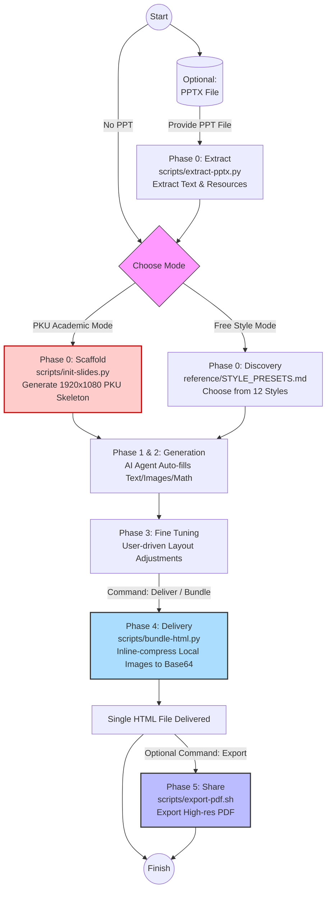

<h1 align="center" style="background: linear-gradient(90deg, #cc0000, #3b82f6, #8b5cf6); -webkit-background-clip: text; -webkit-text-fill-color: transparent; background-clip: text; font-family: 'PingFang SC', sans-serif; font-size: 3rem; font-weight: 600; margin-bottom: 0.5rem; letter-spacing: -1px;">
  ⚡️ Frontend Slides (PKU Edition) ⚡️
</h1>

<p align="center" style="color: #64748b; font-size: 0.95rem; font-family: sans-serif; font-weight: 400;">
  A Claude Code / Gemini skill for creating stunning, animation-rich HTML presentations — from scratch or by converting PowerPoint files.
</p>
<p align="center" style="color: #94a3b8; font-size: 0.8rem;">
  一个用 HTML 制作惊艳、富动画演示文稿的 AI 技能——支持单文件极致便携，或由 PPT 一键转换。
</p>

<p align="center">
  <a href="README.md"></a>&nbsp;
  <a href="README_EN.md"></a>
</p>

<p align="center">
  
  
  
  
  
  <a href="https://github.com/zarazhangrui/frontend-slides/tree/main"></a>
  
</p>

---

> [!NOTE]
> **Acknowledgments** — This project is forked from [@zarazhangrui/frontend-slides](https://github.com/zarazhangrui/frontend-slides/tree/main), retaining all original features (PPT extraction, responsive viewport, 12 visual presets).
> 
> **What's New** — Introduces the **PKU Academic Classic** template, providing strict typographic constraints and scaffold automation for formal group meeting presentations in CMS/CEPC and similar collaborations.
> 
> 💡 **Style Easter Egg:** Transition slide headings use `'Comic Sans MS'` — a tribute to the geeky contrast aesthetic seen in early CERN CMS reports. Falls back to `cursive` if the font is unavailable.

---

## 🚀 Core Workflow



---

## 💡 Three Usage Scenarios

You **only need to describe your requirements to the AI in natural language** — it will automatically orchestrate the correct script pipeline behind the scenes to handle all the technical work.

> [!TIP]
> It is highly recommended to have the Agent enter Plan mode before starting, especially with the [superpowers writing-plans](https://github.com/obra/superpowers/tree/main/skills/writing-plans) skill. It's best to plan your requirements page by page in advance: e.g., what images p1 needs, what bullets p2 should contain.

**(1) PKU Academic Mode**
```text
/hep-frontend-slides

> "Use the PKU_CMS classic layout to create slides for next week's CMS group meeting:
> p1 mainly covers Motivation, listing...
> p2 explains the impact of the 120 ADC cut, with a 6-image comparison grid...
> p3 summarizes conclusions with a highlight box..."
```
**The Agent will:**
1. Before generating any HTML code, **it will mandatorily prompt you to confirm** the following academic specification details:
   | # | Question | Mapped to | Default |
   |---|---------|-----------|---------|
   | Q0 | Choose brand: CMS or CEPC? | Logo + footer | None (required) |
   | Q1 | Main report title? Which keywords to highlight in yellow? | `<h1>` title-banner + footer-left | None (required) |
   | Q2 | Report type / meeting name? | `<h2>` title-banner + footer-right | None (required) |
   | Q3 | Author list? | author-info | None (required) |
   | Q4 | Who is the speaker? (underlined on title slide, centered in footer) | author-info + footer-center | None (required) |
   | Q5 | Affiliation list? | author-info | None (required) |
   | Q6 | Report date? | author-info | Today's date |
   | Q7 | Reference citation? | author-info | Optional |
   | Q8 | Outline list? | Outline + transition slides | None (required) |
   | Q9 | HTML output path? | `init-slides.py --out` | None (required, user-specified) |
2. Once collected, it triggers `init-slides.py` to instantly lay out a 1920x1080 skeleton with dual institutional logos and strict typographic constraints.
3. After rendering, it opens the page for you to preview. **You can use the VSCode Live Server extension to view the result in real time in your browser**.
4. ⭐️ **Key Enhancement: Continuous Layout Fine-tuning**. Unlike traditional one-shot generation tools, you can repeatedly issue instructions for modifications like directing an assistant (e.g., "The text on page 3 is too large — shrink it and add a red highlight-box").
5. **Only when the layout fully meets your requirements**, issue the **"bundle/deliver"** command to the AI. It will embed all local images as Base64, delivering a fully self-contained single-file HTML.
6. 💡 **Presentation Shortcuts**: In PKU mode HTML, press **`F`** to enter/exit browser fullscreen; press **`G`** to open the go-to-slide dialog — type a page number and hit Enter to jump directly.

**(2) Free Style Mode**
```text
/hep-frontend-slides

> "In Free mode, create a set of slides about the latest LLM developments, 10–15 pages"
```
**The Agent will:**
1. Ask about your specific content requirements (slide content, copy, images).
2. Ask about the overall feeling and tone you want (impressive? exciting? calm?).
3. Generate 3 visual style screenshot previews for you to compare and choose from.
4. Generate the complete presentation in your chosen style, available for visual preview in the browser or Live Server.
5. ⭐️ **Continuous Layout Fine-tuning**: Keep having the Agent refine details until perfect.
6. When fully satisfied, issue the **"bundle/deliver"** command to execute the final packaging.

**(3) Convert .pptx to Web Slides**
```text
/hep-frontend-slides

> "Convert TB_Meeting.pptx into web slides / Convert my presentation.pptx to a web slideshow"
```
**The Agent will:**
1. Automatically extract all text content, speaker notes, and losslessly extract all image assets from the original PPT.
2. Present the extracted content outline for your confirmation.
3. Let you freely select your preferred new visual style.
4. One-click generate a complete HTML presentation with images and text (including all your original assets).
5. ⭐️ **Continuous Layout Fine-tuning**: Flexibly re-layout areas where machine conversion was too rigid.
6. Finally, when you are satisfied that everything is pixel-perfect, issue the **"bundle/deliver"** command to package and seal.

---

## 🤖 Auto-connect with Any AI

No more manual file copying. `hep-frontend-slides.md` contains the full set of system constraints (covering token control, canvas ratios, and anti-corruption flow control).
**Follow these steps to let your AI Agent download and bind everything automatically:**

### 1️⃣ Clone the Repository
Clone this repository to your computer or server:
```bash
git clone https://github.com/ky230/frontend-slides-PKU.git
```
*(After cloning, copy and note the absolute path of the folder, e.g., `/Users/name/frontend-slides-PKU`)*

### 2️⃣ Copy the Installation Prompt
Copy the system prompt corresponding to your AI below and paste it directly to the agent (the AI will intelligently replace `{{FRONTEND_SLIDES_REPO_PATH}}` with the local absolute path you provide, binding the system in one step):

<details open>
<summary><b>Gemini / Antigravity / Cursor / Cline (IDE-based Agents)</b></summary>

```text
⚠️ SYSTEM INSTRUCTION: 
I have cloned the "frontend-slides-PKU" repository to my local machine. 
1. Locate the absolute path of the directory, or ask me for it.
2. Read the `hep-frontend-slides.md` file located inside it.
3. Install the rules into your global workflows/skills directory (or .cursorrules if applicable). 
4. IMPORTANT: During installation, replace ALL occurrences of `{{FRONTEND_SLIDES_REPO_PATH}}` in the markdown with the EXACT absolute directory path where this repository is located.
```
</details>

<details open>
<summary><b>GitHub Copilot Chat (VSCode)</b></summary>

```text
@workspace I want to use a new workflow. Please read the `hep-frontend-slides.md` file from the cloned frontend-slides-PKU repository. Then, create a new file named `hep-frontend-slides.md` in my `.github/copilot-instructions/` directory (create the directory if it doesn't exist). Before writing, replace all `{{FRONTEND_SLIDES_REPO_PATH}}` placeholders with the absolute path of the directory you just read from.
```
</details>

<details open>
<summary><b>Claude Code (CLI)</b></summary>

```bash
claude "Read the hep-frontend-slides.md file from the frontend-slides-PKU directory. Copy its contents, replace all {{FRONTEND_SLIDES_REPO_PATH}} placeholders with its absolute path, and save it as .claude.md in my current working directory so these rules are automatically loaded."
```
</details>

> [!NOTE]
> **Do I need to manually edit any source code after cloning?** No. The codebase itself has zero hard-coded paths. The only thing you need to do is paste the installation prompt above to your AI, and it will automatically complete the `{{FRONTEND_SLIDES_REPO_PATH}}` → your local absolute path binding.


---

## 🎨 Original Visual Presets

*If you prefer the "Free Style" mode over PKU Academic when choosing modes, you will unlock 12 stunning web aesthetic presets meticulously designed by the original author:*

| # | File | Style | Category |
|---|---|---|---|
| 01 | `style_01_bold_signal.html` | **Bold Signal** — Orange card + dark gradient | 🌑 Dark |
| 02 | `style_02_electric_studio.html` | **Electric Studio** — White & blue split panel | 🌑 Dark |
| 03 | `style_03_creative_voltage.html` | **Creative Voltage** — Electric blue + neon yellow split | 🌑 Dark |
| 04 | `style_04_dark_botanical.html` | **Dark Botanical** — Dark night + warm gradient orbs | 🌑 Dark |
| 05 | `style_05_notebook_tabs.html` | **Notebook Tabs** — Paper card + colorful tabs | ☀️ Light |
| 06 | `style_06_pastel_geometry.html` | **Pastel Geometry** — Soft blue BG + pill geometry | ☀️ Light |
| 07 | `style_07_split_pastel.html` | **Split Pastel** — Peach & lavender dual-tone split | ☀️ Light |
| 08 | `style_08_vintage_editorial.html` | **Vintage Editorial** — Cream BG + geometric retro type | ☀️ Light |
| 09 | `style_09_neon_cyber.html` | **Neon Cyber** — Cyberpunk neon + particle BG | ✨ Specialty |
| 10 | `style_10_terminal_green.html` | **Terminal Green** — Hacker terminal + scan lines | ✨ Specialty |
| 11 | `style_11_swiss_modern.html` | **Swiss Modern** — Bauhaus grid + red geometry | ✨ Specialty |
| 12 | `style_12_paper_ink.html` | **Paper & Ink** — Literary + drop caps + quote effects | ✨ Specialty |
---

## 🔨 DIY — Create Your Own Template

You don't have to stick with PKU or Free mode — you can create a **third mode** entirely defined by your own organization.

<details>
<summary><b>▸ Expand Full DIY Tutorial (5-Step Process)</b></summary>

Below is the complete workflow we've validated in practice, organized in order **from intuition to rigor**:

> [!IMPORTANT]
> **Path Conventions:** This repository strictly follows a two-layer path separation principle —
> 1. **Environment Injection Layer** (`.md` specs/workflows for the AI): Uniformly use `{{FRONTEND_SLIDES_REPO_PATH}}/...`, automatically replaced by the installation prompt.
> 2. **Product Generation Layer** (HTML templates and scripts): Uniformly use relative paths `assets/xxx.png`. **Absolute paths in HTML `` are forbidden** — otherwise they will all break when someone else clones the repo.
> 
> Place logos in the `assets/` directory; avoid spaces in filenames. `bundle-html.py` will convert them all to Base64 at delivery time, so distribution is never an issue.

---

### Step 1: Prepare Your Logo Assets

Place your institution's logo images (`.png` / `.jpeg`, transparent background recommended) into the repository's `assets/` directory:

```
assets/
├── PKU_logo.jpeg          # Already included
├── CMS_logo.png           # Already included
├── CEPC_logo.png          # Already included
├── YOUR_University.png    # ← Add your own logo
└── YOUR_Lab_logo.png      # ← Add your lab/collaboration logo
```

> [!TIP]
> Recommended logo size: **200×200px** or larger, transparent PNG preferred. bundle-html.py will ultimately compress them all into Base64, so there's no need to worry about file distribution.

---

### Step 2: Use AI to Build Your Empty Template

This is the most fun part. You **don't need to write any HTML/CSS yourself** — just throw your commonly used slide screenshots at the AI and let it replicate:

```text
/hep-frontend-slides

> "I want to create a brand-new academic template. Please reference the complete structure and JS logic of assets/PKU_CMS_Classic_Empty.html.
> My design requirements are:
> - Change the primary color to [your color, e.g., dark blue #003366]
> - Replace the top/bottom bars with [your institution name]
> - Use assets/YOUR_University.png and assets/YOUR_Lab_logo.png for logos
> - Keep the 1920x1080 fixed canvas, MathJax support, scroll-snap navigation, and other features I like
>
> Here are screenshots of a few slides I commonly use — help me match a similar visual style."
```

**Attach screenshots** (your most satisfying pages from PowerPoint/Keynote), and the AI will replace colors, logos, and fonts based on the complete architecture of the PKU empty template, generating a brand-new:

```
assets/YOUR_LAB_Classic_Empty.html    ← AI-generated empty template
```

> [!IMPORTANT]
> The empty template contains only framework code (Logo, Header, Footer, progress bar, one placeholder `<!-- END slides-scroller -->`), **no actual content pages**. Content will be dynamically injected later by `init-slides.py`.

---

### Step 3: Modify the Scaffold Script (init-slides.py)

The existing `scripts/init-slides.py` uses `--template CMS` or `--template CEPC` to select the empty template. You need to make it support your new template:

```text
> "Please modify scripts/init-slides.py to add a --template YOUR_LAB option.
> When the user passes --template YOUR_LAB, read assets/YOUR_LAB_Classic_Empty.html as the skeleton.
> Also change the --speaker default to your own name, and the --affiliations default to your institution."
```

After modification:
```bash
python3 scripts/init-slides.py \
  --template YOUR_LAB \
  --title "My Research Talk" \
  --author "Your Name:1" \
  --event "Lab Meeting" \
  --outline "Introduction:2" "Methods:3" "Results:2" "Back Up:1" \
  --out ./my_talk.html
```

> [!NOTE]
> The purpose of `init-slides.py` is to **strictly prevent the AI from randomly generating HTML skeletons**. In academic scenarios, no matter how artistically talented the Agent is, it will always make tiny but unacceptable errors in "header height, logo position, progress bar color." This script ensures the skeleton comes 100% from your audited empty template, eliminating all layout surprises.

---

### Step 4: Write Your Style Specification File

Following the structure of `reference/PKU_ACADEMIC_CLASSIC.md`, create:
```
YOUR_LAB_CLASSIC.md
```

This file is the **sole law** for the AI when filling in content. It needs to contain the following core sections:

| Section | Purpose | Example Content |
|---------|---------|----------------|
| **§0 Pre-flight Q&A** | Mandatory checklist of questions the AI must confirm with the user before writing | Brand selection, main title, authors, date, outline list |
| **§1 Logo Assets** | Which image files, where they are, how to reference them in HTML | `` |
| **§2 Brand Differences Table** | If you have multiple variants (e.g., Lab A vs B), list the differences | Different logos, minor color adjustments, etc. |
| **§3 Complete CSS** | Extracted verbatim from your Empty.html, serving as a reference copy for the AI | `:root { --primary: #003366; ... }` |
| **§4 MathJax Configuration** | Formula rendering engine settings | Usually can be copied directly from PKU's, no modification needed |
| **§5 HTML Structure Templates** | HTML skeletons for Title/Outline/Transition/Content page types | The AI strictly follows these tag structures when filling content |
| **§6 Complete JavaScript** | Interactive JS extracted from Empty.html (scaling, navigation, progress bar) | Usually can be copied directly from the PKU version |
| **§7 Generation Spec Summary** | A table summarizing all hard constraints (font sizes, fonts, colors, spacing) | Similar to PKU's 27-rule spec table |

> [!TIP]
> You don't need to hand-write these 800+ lines. Just tell the AI:
> ```text
> > "Following the exact structure of reference/PKU_ACADEMIC_CLASSIC.md, generate the corresponding style spec file for my YOUR_LAB_Classic_Empty.html.
> > Extract the CSS, JS, and HTML structures, replace colors and logo paths, and keep all other constraints."
> ```

---

### Step 5: Register in the Main Skill File

The final step is to let the Agent **see and select your new template** when launching the slides workflow.

Open `hep-frontend-slides.md` and find the mode selection section:
```markdown
> Choose a template mode:
> 1. 🏛️ **PKU Academic Classic** — Group meetings / academic reports (red-yellow classic, dual logos, fixed layout)
> 2. ⚡️ **Free** — Free style (12 presets, responsive, suitable for pitch/tech talk/creative presentations)
```

Add your new option:
```markdown
> 3. 🔬 **YOUR_LAB Classic** — Your lab's exclusive template (dark blue theme, dual logos, fixed layout)
```

Then, following the pattern of the PKU Academic rules section in the file, add a new block pointing to your `YOUR_LAB_CLASSIC.md` read instruction:
```markdown
### If YOUR_LAB Classic is selected
**Must read the style specification file first:**
```
{{FRONTEND_SLIDES_REPO_PATH}}/YOUR_LAB_CLASSIC.md
```
```

At this point, you have a presentation system **completely defined by your own aesthetics and academic requirements, immune to AI's ad-hoc modifications**.

---

### 📝 Complete DIY Checklist

```
1. [ ] Place your logo images in the assets/ directory
2. [ ] Have AI generate your empty template based on PKU_CMS_Classic_Empty.html
3. [ ] Modify init-slides.py to support the new --template option
4. [ ] Have AI generate your style spec based on reference/PKU_ACADEMIC_CLASSIC.md
5. [ ] Register your new mode in hep-frontend-slides.md
6. [ ] Battle-test it with a real group meeting presentation!
```

---

</details>

---
*Created by [@zarazhangrui](https://github.com/zarazhangrui). Extended by Leyan Li with Academic Rigor.*  
*Inspired by the "Vibe Coding" philosophy — building beautiful things without being a traditional software engineer.*
